#### These procedure steps will be followed on the simulator

1. Open the Kaplan turbine experiment under constant head condition and click on the arrow mark shown at the bottom right corner. 
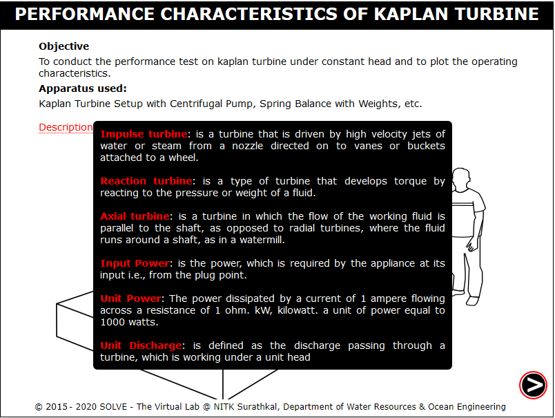 

2. Click on the green button to start the pump, select the head and click on NEXT button. 
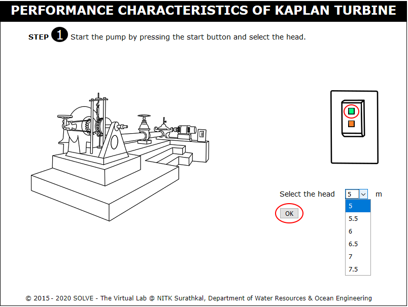 

3. Click on the hand wheel to rotate the inlet valve and allow the water to flow. 
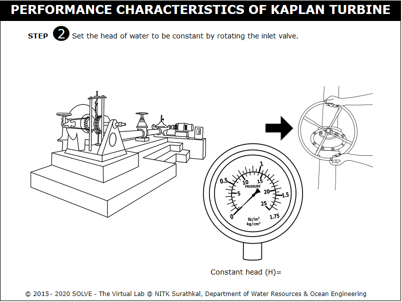 

4. Note the constant head reading and click on NEXT button. 
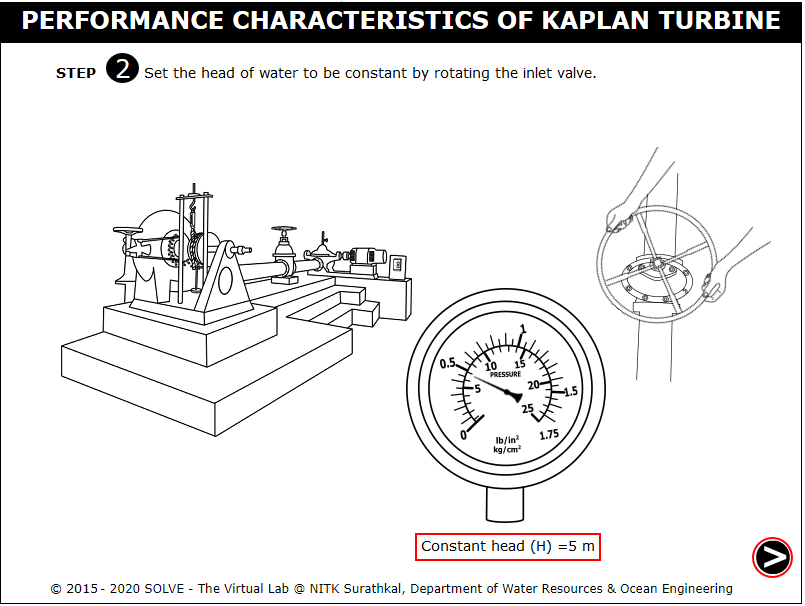 

5. Calculate the torque reading for the corresponding applied weight, and click on NEXT button. 
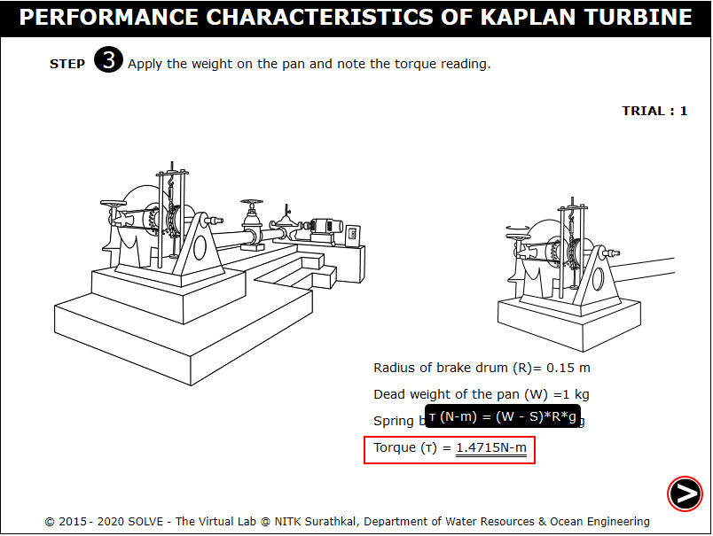 

6. Click on the hand to insert the tachometer. 
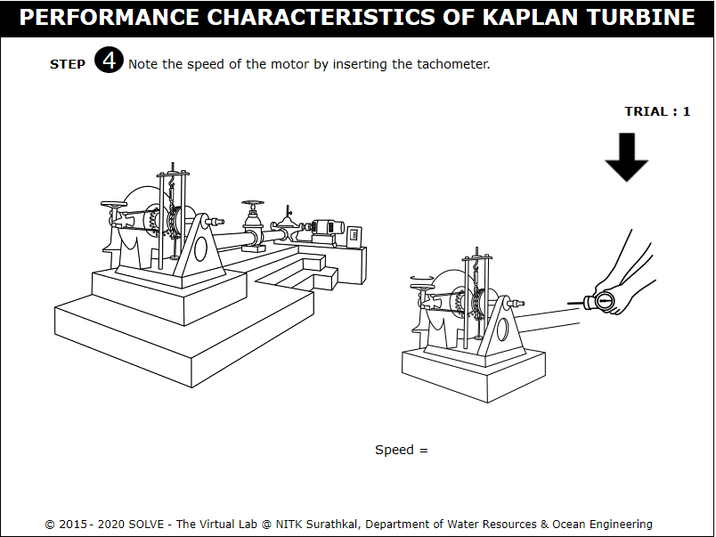 

7. Note the speed of motor and click on the NEXT button. 
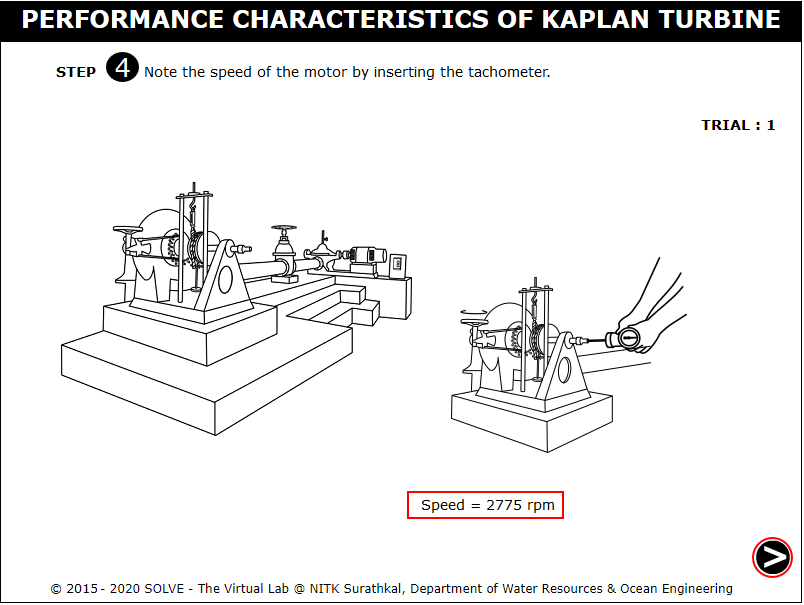 

8. Note the initial hook gauge reading and click on the hook gauge knob. 
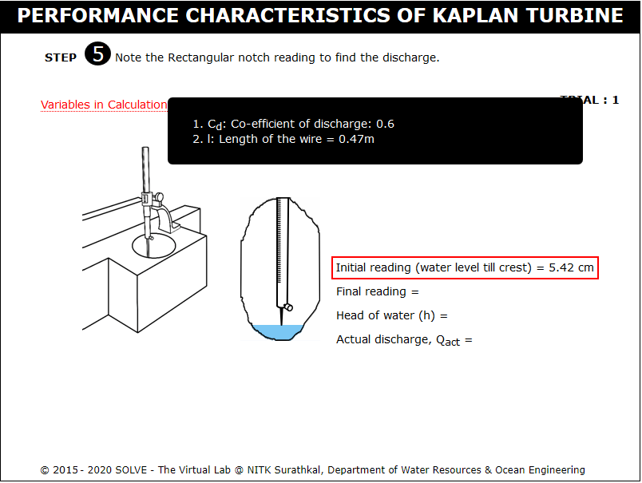 

9. Note the final hook gauge reading,calculate the actual discharge and then click on the NEXT button. 
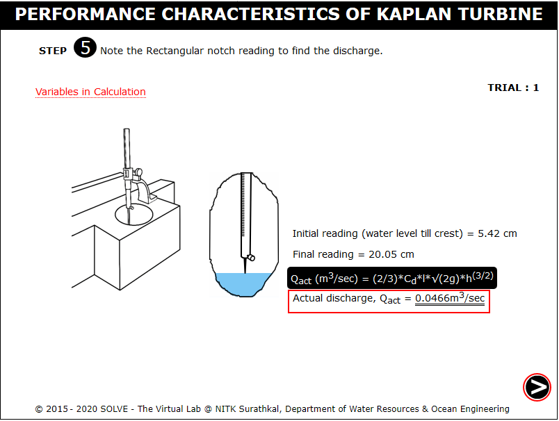 

10. Note the results of Trial 1 and then click on the NEXT button to continue the experiment. 
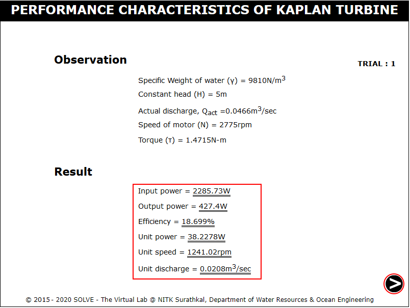 

11. Repeat the same procedure, after certain trials click on the red button to stop the pump and click on the NEXT button to see the characteristic graphs. 
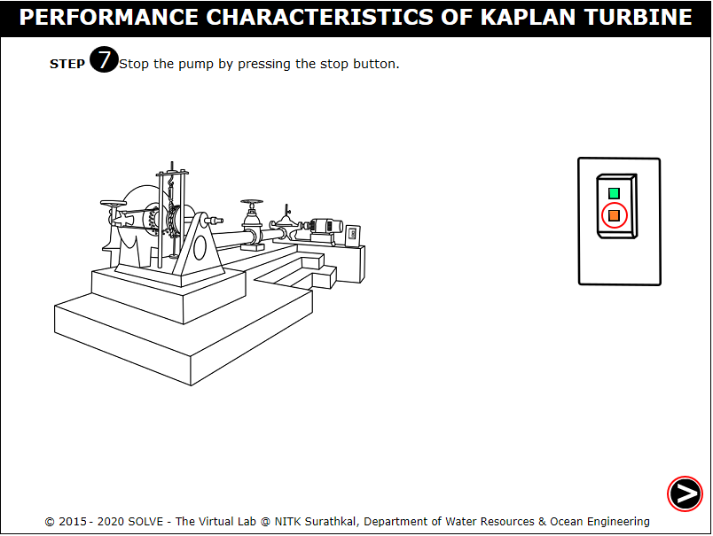 

12. Click on each label box to see the different characteristic graph. 
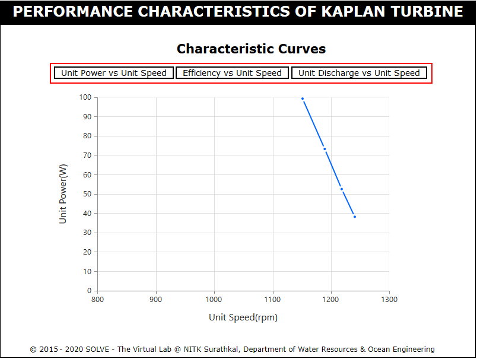 
