### INTRODUCTION 

Turbines are the turbo machines transferring fluid energy into mechanical energy. Victor Kaplan designed a turbine similar to the propellers of ships for generating hydropower in locations where large quantities of water are available under a relatively low head. The Kaplan Turbine is also called as  Propeller Turbine. It has a propeller like blades, here Instead of displacing the water axially using shaft power and creating axial thrust, the axial force of water acts on the blades of Kaplan Turbine and generates shaft power. To generate substantial amount of power from small heads of water using Kaplan Turbine it is necessary to have large flow rates through the turbine. Kaplan Turbine is designed to accommodate the required large flow rates. Consequently the specific speed of these turbines is high, viz., 300 to 1000.

Kaplan Turbine is an Axial Flow Reaction Turbine, which means that the flow direction does not change as it crosses the rotor. For Axial Flow Turbines, the water flows through the runner along the direction parallel to the axis of rotation of the runner. Reaction Turbine means that the water at the inlet of the Turbine possesses kinetic energy as well as pressure energy.

  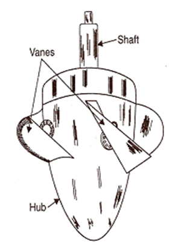

Kaplan Turbine
 

Source: (<a href="http://engineering.myindialist.com/2009/lab-manual-kaplan-turbine/#.XWTJpegzbIU">http://engineering.myindialist.com/2009/lab-manual-kaplan-turbine/#.XWTJpegzbIU</a>)

 

<h4 style="text-indent:50px;text-align:justify">Components of Kaplan Turbine:</h4>

Except the alignment of the blades the construction of the Kaplan Turbine is very much similar to that of the Francis Turbine.

Sectional View of Kaplan Turbine
 

Source: (<a href="https://www.brainkart.com/article/Kaplan-turbine_5578">https://www.brainkart.com/article/Kaplan-turbine_5578</a>)
 

<ol style="text-indent:50px;text-align:justify;list-style-position: inside;">
<li><strong>Penstock</strong>: It is a waterway used to carry the water from reservoir to turbine. At the inlet of the penstock trash cracks are used to prevent the debris going into the turbine.</li>

<li><strong>Scroll Casing</strong>: The annular channel surrounding the turbine runners to which water is fed spiral in its layout and also called as spiral casing. Casing constitutes a closed passage whose cross sectional area gradually decreases along the flow direction, area is maximum at the inlet and nearly zero at the outlet.</li>

<li><strong>Guide Vane Mechanism</strong>: A series of aerofoil shaped vanes arranged inside the casing to form a number of flow passages between the casing and the runner blades. The water from the penstocks enters the scroll casing and then moves to the guide vanes. From the guide vanes, the water turns through 90° and flows axially through the runner.</li>

<li><strong>Hub</strong>: For Kaplan Turbine, the shaft of the turbine is vertical. The lower end of the shaft is made larger and is called ‘Hub’ or ‘Boss’. The vanes are fixed on the hub and hence Hub acts as runner for axial flow turbine.</li>

<li><strong>Runner</strong>: The runner of a Kaplan Turbine has four to six or even eight blades and it closely resembles a shape of a ships propeller. The blades are attached to the hub, the runner blades are fixed but the angle of inclination may be adjusted while the turbine is in motion.

Kaplan Turbine Rotor Blade Positions
 

Source: (<a href="https://www.renewablesfirst.co.uk/hydropower/hydropower-learning-centre/kaplan-turbines/">https://www.renewablesfirst.co.uk/hydropower/hydropower-learning-centre/kaplan-turbines/</a>)
</li>

<li><strong>Draft Tube</strong>: The draft tube is a pipe or passage of gradually increasing cross sectional area which connects the runner exit to the tail race. It may be made of cast or plate steel or concrete. It permits the negative or suction head to be established at the runner exit and also converts large proportion of velocity energy rejected from the runner into useful pressure energy.</li>
</ol>

<strong>Specifications</strong>:

<ol style="text-indent:50px;text-align:justify;list-style-position: inside;">
<li>Type – Reaction turbine</li>
<li>Type of flow – Axial</li>
<li>Head – Low (below 40 m)</li>
<li>Number of blades on runner – 3 or 4 (max. 6)</li>
<li>Specific speed – High - 250 to 850</li>
<li>Discharge – High</li>
</ol>

<strong>Operations & Maintenance</strong>:

It is commonly accepted that turbines normally suffer from a progressive deterioration in performance over time. Usual causes include cavitation damage, abrasive erosion wear, galvanic corrosion, striking damage from debris passing through, and errors in welding repairs to original blade profiles and surface finish. A certain amount of cavitation is inherent in a Kaplan runner, primarily due to gaps between the blade inner periphery and hub, and between the blade outer periphery and throat rings. Kaplan runner blades are designed with stress relief grooves at the leading and trailing sides of the blade intersection. These grooves, located to minimize the possibility of cracking in the high stress areas of the blade create cavities in the flow profile which cause downstream disturbances in the form of low pressure vertices and can result in cavitation erosion on the hub and nose cone. Cavitation is unavoidable in Kaplan turbine because there is huge pressure drop associated with energy extraction from fluid. Cladding with 309L stainless steel welding electrode provides some cavitation resistance. Turbine shaft areas near the shaft seal that are exposed to water should be sealed with a robust coating such as an epoxy paint to prevent corrosion of the shaft. Adequate coating of the turbine wetted components not only prevents corrosion but has added benefits of improved performance. The typical areas of cavitation damage are shown in the figure.

 Deterioration in Kaplan Turbine 
 

Source: (HAP project 2012)
 

<strong>Comparison between reaction turbine and impulse turbine:</strong>

|Reaction Turbine |	Impulse Turbine|
:----------------:  | :-----------------:
| Only a fraction of the available hydraulic energy is converted into kinetic energy before the fluid enters the runner.|	All the available hydraulic energy is converted into kinetic energy by a nozzle and it is the jet so produced which strikes the runner blades|
Both pressure and velocity change as the fluid passes through the runner. Pressure at inlet is much higher than at the outlet. | 	It is the velocity of jet which changes, the pressure throughout remaining atmospheric.
The runner must be enclosed within a watertight casing (scroll casing). | 	Water-tight casing is not necessary. Casing has no hydraulic function to perform. It only serves to prevent splashing and guide water to the tail race
 Water is admitted over the entire circumference of the runner. |	Water is admitted only in the form of jets. There may be one or more jets striking equal number of buckets simultaneously
Water completely fills at the passages between the blades and while flowing between inlet and outlet sections does work on the blades |	The turbine does not run full and air has a free access to the buckets
The turbine is connected to the tail race through a draft tube which is a gradually expanding passage. It may be installed above or below the tail race. |	The turbine is always installed above the tail race and there is no draft tube used
The flow regulation is carried out by means of a guide-vane assembly. Other component parts are scroll casing, stay ring, runner and the draft tube |	Flow regulation is done by means of a needle valve fitted into the nozzle.

<strong>Working proportions of a Kaplan Turbine</strong>:

Consider a Kaplan turbine with H= Net head on the turbine, N= Rotational speed in rpm, P= Power developed by it, Do = Outer diameter of the runner, Db = Outer diameter of the hub, q= Discharge through turbine under head of H.

Area of flow at inlet

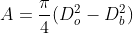

Velocity of flow at inlet and outlet in Kaplan turbine is same.

Velocity of inlet = velocity of outlet

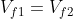

Peripheral velocity at inlet and outlet are equal,

Discharge through the runner is

Discharge through a rectangular notch is

Torque,

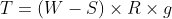

Where, -applied load in kg, 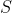- spring reading in kg, 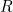-radius of brake drum in m

Input power

Where, -Density of water, -Acceleration due to gravity, -Discharge in m3/sec, -Total head in m

Output power

Where, 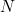-speed in rpm, -torque in N-m

Unit speed is the speed of a given turbine when running under a unit head.

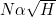

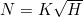

When =1 m, then = unit speed

Unit discharge is the discharge of the turbine under a head of one meter.

 = area × discharge

But area = constant

When =1 m, then 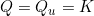

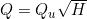

Where 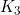 is constant of proportionality,

When =1m, then 

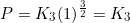

Then substituting 

